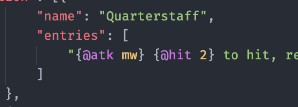
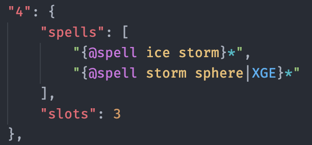

# 5e.tools Tags

A simple extension that changes the color of "tags" used for creating content for [5e.tools](https://5e.tools). A tag takes one of the following forms:

-   `{@tag}`
-   `{@tag content}`
-   `{@tag content}*`
-   `{@tag content|source}`
-   `{@tag content|source}*`
-   `{@tag content|source|chapter}`
-   `{@tag content|source|chapter}*`
-   ...and so forth

## Examples




## Possible Tags

This is a list of all tags that can be used properly with [5e.tools](https://5e.tools). Please make a github issue if there are any problems.

`@5etools`
`@action`
`@adventure`
`@area`
`@atk`
`@b`
`@background`
`@bold`
`@book`
`@boon`
`@chance`
`@class`
`@classFeature`
`@color`
`@condition`
`@creature`
`@cult`
`@d20`
`@damage`
`@dc`
`@deity`
`@dice`
`@disease`
`@feat`
`@filter`
`@footnote`
`@hazard`
`@h`
`@hit`
`@homebrew`
`@i`
`@italic`
`@item`
`@language`
`@link`
`@loader`
`@note`
`@object`
`@optfeature`
`@psionic`
`@race`
`@recharge`
`@reward`
`@s`
`@scaledice`
`@sense`
`@skill`
`@spell`
`@strike`
`@subclassFeature`
`@table`
`@tags`
`@trap`
`@variantrule`
`@vehicle`

retrieved by copy-pasting the [5e.tools renderer demo](https://5e.tools/renderdemo.html) into `rendererDemo.txt` and running this bash command (which for some reason misses out on `@area` and `@h`):

```bash
cat rendererDemo.txt | grep -o -e "@[^ |^}|^.]*" | sort -u
```
